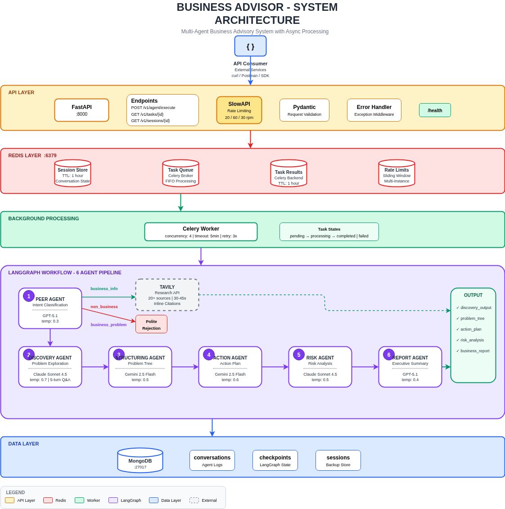

# Business Advisor API

İş problemlerini analiz eden çok ajanlı sistem. Kullanıcı bir sorun bildiriyor, sistem sorular sorup kök nedeni buluyor, sonra aksiyon planı ve risk analizi çıkarıyor.

## Ne Yapıyor?

Üç tip sorguyu işliyor:

- **Sektör soruları** → Tavily ile araştırma, kaynaklı cevap
- **İş problemleri** → 3-5 tur soru-cevap, detaylı analiz raporu  
- **Konu dışı** → Kibarca reddediyor

## Mimari

### Sistem Diyagramı



```
                                ┌─────────────┐
                                │   CLIENT    │
                                └──────┬──────┘
                                       │
                          ┌────────────┴────────────┐
                          │      1. POST /execute   │
                          │      2. GET /tasks/{id} │
                          ▼                         │
                ┌───────────────────┐               │
                │  FastAPI Server   │               │
                │   (Port 8000)     │               │
                │   + SlowAPI       │               │
                └─────────┬─────────┘               │
                          │                         │
       ┌──────────────────┼──────────────────┐      │
       │                  │                  │      │
       ▼                  ▼                  ▼      │
┌─────────────────┐  ┌─────────────┐  ┌─────────────┐│
│     Redis       │  │   Redis     │  │   Redis     ││
│  Session Store  │  │Task Queue   │  │Task Results ││
│   (DB 0)        │  │  (Celery)   │  │  (Celery)   ││
│                 │  │             │  │             ││
│ • session_id    │  │ • pending   │  │ • completed │◄┘
│ • conversation  │  │   tasks     │  │   results   │
│ • TTL: 1 hour   │  │             │  │ • TTL: 1hr  │
│ • rate limits   │  │             │  │             │
└─────────────────┘  └──────┬──────┘  └─────────────┘
                            │
                            ▼
                  ┌───────────────────┐
                  │   Celery Worker   │
                  │                   │
                  │ • concurrency: 4  │
                  │ • timeout: 5min   │
                  └─────────┬─────────┘
                            │
                            ▼
                  ┌───────────────────┐
                  │ LangGraph Workflow│
                  │                   │
                  │ ┌───────────────┐ │
                  │ │  Peer Agent   │ │
                  │ │  (GPT-5.1)    │ │
                  │ └───────┬───────┘ │
                  │         │         │
                  │    ┌────┴────┐    │
                  │    ▼         ▼    │
                  │ ┌─────┐ ┌───────┐ │
                  │ │Info │ │Problem│ │
                  │ │Flow │ │ Flow  │ │
                  │ └──┬──┘ └───┬───┘ │
                  │    │        │     │
                  │    ▼        ▼     │
                  │ ┌─────┐ ┌───────┐ │
                  │ │Tavily│ │Discov.│ │
                  │ │Rsch │ │Agent  │ │
                  │ └─────┘ │(Claude)│ │
                  │         └───┬───┘ │
                  │             │     │
                  │             ▼     │
                  │        ┌───────┐  │
                  │        │Struct.│  │
                  │        │Agent  │  │
                  │        │(Gemini)│ │
                  │        └───────┘  │
                  └─────────┬─────────┘
                            │
                            ▼
                  ┌───────────────────┐
                  │     MongoDB       │
                  │                   │
                  │ • Conversation    │
                  │   Logs            │
                  │ • LangGraph       │
                  │   Checkpoints     │
                  └───────────────────┘
```

### Neden Asenkron?

İlk versiyonda senkron denedim. Tavily araştırması 30-40 saniye, üstüne LLM çağrıları eklenince 1-2 dakika. HTTP timeout kaçınılmaz oldu.

Celery ile queue'ya atıyorum, client polling yapıyor. Kullanıcı "işleniyor" görüyor, sayfa donmuyor.

```
Senkron (sorunlu):
Client ──► API ──► LLM (10sn) ──► Tavily (40sn) ──► Response
                   └──────────── HTTP Timeout ────────────┘

Asenkron (çözüm):
Client ──► API ──► Redis Queue ──► task_id döner (50ms)
                        │
                        ▼
                  Celery Worker (arka planda çalışır)
                        │
                        ▼
Client ◄─── GET /tasks/{id} ile polling
```

### Servisler

- **FastAPI** (8000): REST API, rate limiting
- **Redis** (6379): Queue + session store + rate limit backend
- **MongoDB** (27017): Conversation log + LangGraph checkpoint
- **Celery**: Background worker

Redis'i üç iş için kullanıyorum - ayrı servis kurmak yerine tek Redis daha basit.

## Agent Akışı

```
                         ┌─────────────────┐
                         │   User Input    │
                         └────────┬────────┘
                                  │
                                  ▼
                         ┌─────────────────┐
                         │   Peer Agent    │
                         │   (GPT-5.1)     │
                         │   temp: 0.3     │
                         └────────┬────────┘
                                  │
                    ┌─────────────┼─────────────┐
                    │             │             │
                    ▼             ▼             ▼
            ┌───────────┐ ┌───────────┐ ┌───────────┐
            │  business │ │  business │ │    non    │
            │   _info   │ │  _problem │ │ _business │
            └─────┬─────┘ └─────┬─────┘ └─────┬─────┘
                  │             │             │
                  ▼             │             ▼
            ┌───────────┐       │       ┌───────────┐
            │  Tavily   │       │       │  Polite   │
            │ Research  │       │       │ Rejection │
            └─────┬─────┘       │       └───────────┘
                  │             │
                  ▼             ▼
            ┌───────────┐ ┌───────────┐
            │  Report   │ │ Discovery │
            │ + Sources │ │   Agent   │
            └───────────┘ │(Claude 4.5)│
                          │ temp: 0.7 │
                          └─────┬─────┘
                                │
                                │ 3-5 turns Q&A
                                │
                                ▼
                          ┌───────────┐
                          │Structuring│
                          │(Gemini 2.5)│
                          └─────┬─────┘
                                │
                                ▼
                          ┌───────────┐
                          │ActionPlan │
                          │(Gemini 2.5)│
                          └─────┬─────┘
                                │
                                ▼
                          ┌───────────┐
                          │   Risk    │
                          │(Claude 4.5)│
                          └─────┬─────┘
                                │
                                ▼
                          ┌───────────┐
                          │  Report   │
                          │ (GPT-5.1) │
                          └───────────┘
```

### Çıktı Yapısı

```
├── discovery_output
│   ├── customer_stated_problem
│   ├── identified_business_problem
│   ├── hidden_root_risk
│   └── conversation_turns[]
│
├── problem_tree
│   ├── problem_type
│   ├── main_problem
│   └── causes[] → sub_causes[]
│
├── action_plan
│   ├── short_term[] (0-3 ay)
│   ├── mid_term[] (3-6 ay)
│   ├── long_term[] (6-12 ay)
│   ├── quick_wins[]
│   └── success_metrics[]
│
├── risk_analysis
│   ├── risks[] → probability, impact, mitigation
│   └── overall_risk_level
│
└── business_report
    ├── executive_summary
    └── report_markdown
```

### Model Seçimleri

| Agent | Model | Temp | Neden? |
|-------|-------|------|--------|
| Peer | GPT-5.1 | 0.3 | Sınıflandırmada tutarlı, %98 accuracy |
| Discovery | Claude Sonnet 4.5 | 0.7 | Multi-turn'de context kaybetmiyor |
| Structuring | Gemini 2.5 Flash | 0.5 | JSON output'ta hızlı ve schema'ya sadık |
| ActionPlan | Gemini 2.5 Flash | 0.6 | Maliyet-performans dengesi iyi |
| Risk | Claude Sonnet 4.5 | 0.5 | Reasoning kalitesi önemli |
| Report | GPT-5.1 | 0.4 | Markdown formatting kalitesi yüksek |

**Neden bu dağılım?**

- **GPT-5.1 (Peer, Report):** Classification ve formatting task'larında tutarlı. Peer'da aynı input aynı intent vermeli.
- **Claude Sonnet 4.5 (Discovery, Risk):** 5 tur boyunca önceki cevapları hatırlayıp ilişkili sorular üretiyor. Risk'te reasoning kalitesi kritik.
- **Gemini 2.5 Flash (Structuring, ActionPlan):** Nested JSON yapılarda schema'ya sadık. Bu iki agent sık çağrılıyor, Gemini ~3x ucuz.

**Temperature seçimleri:**
- 0.3: Deterministic olmalı (classification)
- 0.5: Dengeli (analysis)
- 0.6-0.7: Yaratıcı sorular ve öneriler için

### Tavily: Search vs Research

İki mod var:

| Özellik | Search | Research |
|---------|--------|----------|
| Süre | 1-3 saniye | 30-40 saniye |
| Kaynak | 3-5 | 20+ |
| Çıktı | Kısa snippet | Detaylı Markdown |

Research tercih ettim. Evet yavaş, ama resmi kaynaklar ve istatistikler getiriyor. Zaten Celery'de çalışıyor, 30-40 saniye sorun değil.

## Prompt Mühendisliği

Promptlar `app/prompts/` altında YAML formatında tutuluyor. Kod değişikliği yapmadan prompt güncellenebilir.

### Prompt Dosya Yapısı

```yaml
system: |
  [Rol tanımı]
  [Görev açıklaması]
  [Kısıtlamalar]
  [Few-shot örnekler]

user: |
  [Input template - {variable} formatında]
  [Output format talimatı]

temperature: 0.5
max_tokens: 1000
```

### Kullanılan Teknikler

**Few-shot Learning:** Her prompt'ta 2-3 örnek var. Model ne yapacağını açıklamadan değil, örnekten öğreniyor.

```yaml
# Örnek: peer_classify.yaml
system: |
  Kullanıcı mesajlarını kategorize et.
  
  ÖRNEKLER:
  
  Kullanıcı: "Rakiplerimiz kimler?"
  Kategori: business_info
  
  Kullanıcı: "Satışlar düşüyor"
  Kategori: business_problem
  
  Kullanıcı: "Hava nasıl?"
  Kategori: non_business
```

**Chain-of-thought:** Karmaşık görevlerde adım adım düşünme.

```yaml
# Discovery agent'ta reasoning
system: |
  Önce düşün:
  1. Müşteri ne söyledi?
  2. Hangi bilgi eksik?
  3. Bu bilgiyi almak için en iyi soru ne?
  
  Sonra soruyu yaz.
```

**Structured Output:** JSON schema ile çıktı formatı zorlama.

```yaml
# Structuring agent JSON output
system: |
  ÇIKTI FORMATI (sadece JSON):
  {
    "problem_type": "Growth|Cost|Operational|...",
    "main_problem": "string",
    "problem_tree": [
      {"main_cause": "string", "sub_causes": ["string"]}
    ]
  }
```

**Negative Examples:** Yapılmaması gerekenleri gösterme.

```yaml
system: |
  YAPMA:
  - Çözüm önerme (sadece soru sor)
  - Birden fazla soru sorma
  - Kullanıcıyı yönlendirme
```

### Neden YAML?

- **Versiyon kontrolü:** Prompt değişiklikleri git history'de görünür
- **Kod ayrımı:** Prompt mantığı Python'dan bağımsız
- **Kolay test:** Farklı prompt versiyonları A/B test edilebilir
- **Non-technical edit:** Prompt'ları düzenlemek için Python bilmek gerekmiyor

## Rate Limiting

SlowAPI kullanıyorum, Redis backend'li:

| Endpoint | Limit | Gerekçe |
|----------|-------|---------|
| `POST /v1/agent/execute` | 20/dakika | Her istek LLM maliyeti |
| `GET /v1/tasks/{id}` | 60/dakika | Polling için yeterli |
| `GET /v1/sessions/{id}` | 30/dakika | Debug için |

## Loglama

İki katman var:

**1. stdout (anlık debug için)**

Development'ta okunabilir format:
```
14:23:17 | INFO     | advisor [session=abc, agent=peer] | Task completed
```

Docker'da (`APP_ENV=production`) JSON format:
```json
{"timestamp": "2026-02-02T11:00:34.063151+00:00", "level": "INFO", "logger": "advisor", "message": "Task completed - intent: business_problem", "session_id": "c058ccb4-99fd-43c3-bc47-90f2b9666993", "agent": "worker"}
```

**2. MongoDB (analiz için)**

Tamamlanan conversation'lar `conversations` collection'ına yazılıyor. Worker'da `_persist_completed_session()` fonksiyonu bunu yapıyor.

## Kurulum

```bash
git clone https://github.com/username/business-advisor.git
cd business-advisor
cp .env.example .env
# API key'leri .env'e ekle
docker compose up -d --build
```

Health check:
```bash
curl http://localhost:8000/health
```

### Environment Variables

```env
OPENAI_API_KEY=sk-...
ANTHROPIC_API_KEY=sk-ant-...
GOOGLE_API_KEY=AI...
TAVILY_API_KEY=tvly-...
MONGODB_URI=mongodb://localhost:27017
REDIS_URL=redis://localhost:6379/0
```

## API

| Endpoint | Açıklama |
|----------|----------|
| `POST /v1/agent/execute` | Task gönder |
| `GET /v1/tasks/{id}` | Sonuç sorgula (polling) |
| `GET /v1/sessions/{id}` | Session durumu |
| `GET /health` | Sağlık kontrolü |

## Örnek Kullanım

### İş dışı soru

```bash
curl -X POST http://localhost:8000/v1/agent/execute \
  -H "Content-Type: application/json" \
  -d '{"task": "Bugün hava nasıl?"}'
```

```json
{
  "task_id": "99c812dd-6a82-407d-a4d9-56193dd307b5",
  "session_id": "bce84a41-7ef5-4639-8265-bb6267545fa4",
  "status": "pending"
}
```

```bash
curl http://localhost:8000/v1/tasks/99c812dd-6a82-407d-a4d9-56193dd307b5
```

```json
{
  "status": "completed",
  "result": {
    "intent": "non_business",
    "message": "Bu sistem iş problemleri için tasarlandı. Hava durumunu iş perspektifinden ele alabilirim...",
    "is_complete": true
  }
}
```

### Sektör araştırması

```bash
curl -X POST http://localhost:8000/v1/agent/execute \
  -H "Content-Type: application/json" \
  -d '{"task": "Türkiye e-ticaret sektöründe en büyük 5 şirket?"}'
```

30-40 saniye sonra detaylı rapor döner - Trendyol, Hepsiburada, Amazon TR, n11, Getir sıralamasıyla, kaynaklı.

### İş problemi (full cycle)

```bash
# 1. Problem bildir
curl -X POST .../execute -d '{"task": "Müşteri şikayetleri son 6 ayda %40 arttı"}'
# Sistem soruyor: "Şikayetler hangi konuda?"

# 2. Cevap ver (session_id ile)
curl -X POST .../execute -d '{"task": "Teslimat gecikmeleri", "session_id": "..."}'
# Sistem soruyor: "Gecikmelerin kaynağı nedir?"

# ... 3-5 tur sonra tam analiz çıkıyor
```

<details>
<summary>Tam çıktı örneği</summary>

```json
{
  "discovery_output": {
    "customer_stated_problem": "Müşteri şikayetleri son 6 ayda %40 arttı",
    "identified_business_problem": "Depo düzeni ve envanter sistemi yetersizliği nedeniyle sipariş hazırlama 2-3 güne uzamış",
    "hidden_root_risk": "Envanter sisteminin gerçek stok durumunu yansıtmaması",
    "conversation_turns": [
      {"question": "Şikayetler hangi konuda?", "answer": "Teslimat gecikmeleri", "turn_number": 1},
      {"question": "Gecikme kaynağı?", "answer": "Kendi depomuz", "turn_number": 2}
    ]
  },
  "problem_tree": {
    "problem_type": "hybrid",
    "main_problem": "Müşteri Şikayetlerinde %40 Artış",
    "problem_tree": [
      {"main_cause": "Envanter Yönetimi", "sub_causes": ["Sistem güncel değil", "Fiziksel sayım yok"]},
      {"main_cause": "Depo Verimsizliği", "sub_causes": ["Kötü yerleşim", "Picking yavaş"]}
    ]
  },
  "action_plan": {
    "short_term": [
      {"action": "Acil stok sayımı", "timeline": "2 hafta", "owner": "Depo Ekibi", "priority": "high"}
    ],
    "mid_term": [...],
    "long_term": [...],
    "quick_wins": ["Stok sayımı", "5S uygulaması"],
    "success_metrics": ["Şikayetlerde %40 azalma", "Hazırlık 1 güne düşsün"]
  },
  "risk_analysis": {
    "overall_risk_level": "high",
    "top_priority_risk": "Bütçe yetersizliği",
    "risks": [
      {"risk_name": "Personel direnci", "probability": "high", "impact": "high", "mitigation": "Değişim şampiyonları programı"}
    ]
  },
  "business_report": {
    "executive_summary": "Şikayetlerin ana nedeni depo ve envanter sorunları. 2 hafta içinde stok sayımı kritik.",
    "report_markdown": "# İş Problemi Analiz Raporu\n\n## Yönetici Özeti\n..."
  }
}
```

</details>

## Testler

```bash
# Unit testler - data structure validation
poetry run pytest tests/test_unit.py -v

# Integration testler - gerçek API çağrıları
docker compose up -d
poetry run pytest tests/test_integration.py -v
```

### Test Sonuçları

```
tests/test_unit.py - 19 passed
tests/test_integration.py - 8 passed
================================
TOTAL: 27 passed
```

### Test Kapsamı

| Modül | Test Sayısı |
|-------|-------------|
| DiscoveryOutputStructure | 2 |
| ProblemTreeStructure | 3 |
| ActionPlanStructure | 3 |
| RiskAnalysisStructure | 3 |
| BusinessReportStructure | 2 |
| AgentFlowLogic | 4 |
| SessionStateLogic | 2 |

### Test Yaklaşımı

**Unit testler** (`test_unit.py`): Fixture data ile structure validation. Field'lar var mı, değerler valid mi, agent flow mantığı doğru mu.

**Integration testler** (`test_integration.py`): Gerçek API çağrıları. Health check, error handling, non-business rejection, discovery flow, business info with sources.

LLM mock'u kullanmadım çünkü LLM response'ları non-deterministic. Mock'lamak yerine gerçek davranışı test etmek daha değerli.

### Test Genişletme Önerileri

**Edge Case Testleri:**
- Boş input, çok uzun input (10K+ karakter)
- Özel karakterler, SQL injection denemeleri
- Geçersiz session_id, expire olmuş session

**Load Testing:**
- Locust ile concurrent request testi
- Rate limiting davranışı doğrulama
- Redis/MongoDB bottleneck tespiti

**E2E Test Otomasyonu:**
- Tam 5 turlu discovery senaryosu
- Farklı problem tipleri (Growth, Cost, Operational)
- Session timeout ve recovery

## Deployment

```bash
docker compose up -d
```

CI/CD için `.github/workflows/deploy.yml` var - push'ta test, main'e merge'de deploy.

## Teknik Kararlar

### Neden MongoDB?

PostgreSQL yerine MongoDB tercih ettim:

- **Document model:** Conversation data'sı doğal olarak nested JSON yapısında. Her turn, her agent çıktısı iç içe document olarak saklanıyor. Relational model'de bu 5-6 tablo ve JOIN gerektirir.
- **Esnek schema:** Agent'lar geliştikçe çıktı yapıları değişiyor. MongoDB'de migration yapmadan yeni field eklenebilir.
- **LangGraph entegrasyonu:** `langgraph-checkpoint-mongodb` paketi hazır. PostgreSQL için manuel implementasyon gerekir.

### Neden LangGraph?

- State management hazır
- Checkpoint'lar hazır (MongoDB ile entegre)
- Yeni agent eklemek = sadece node ekle
- Kendi workflow engine yazmaktan daha güvenilir

### Neden Redis?

Tek Redis instance üç farklı iş görüyor:

- **Session store:** Multi-turn conversation state'i (TTL: 1 saat)
- **Celery broker:** Task queue
- **Rate limiting:** SlowAPI backend'i

Memcached alternatifti ama rate limiting için sorted set gibi veri yapıları gerekti, Redis bunu native destekliyor.

### Session TTL neden 1 saat?

Discovery 3-5 tur sürüyor. Kullanıcı her turda düşünebilir. 1 saat makul.

### Celery timeout neden 5 dakika?

Full flow (6 agent + Tavily) en kötü durumda 3-4 dakika. 5 dakika buffer'lı değer.

### Discovery neden 3-5 soru?

Config'den ayarlanabilir (`discovery_min_questions`, `discovery_max_questions`). 3'ten az yüzeysel kalıyor, 5'ten fazla kullanıcıyı yoruyor. Gerçek testlerde genelde 4. soruda yeterli bilgi toplandığını gördüm.

## Bilinen Limitasyonlar

- Türkçe prompt'lar var, uluslararası kullanım için çeviri gerekir
- Session recovery yok - worker crash olursa conversation kaybolur
- Rate limiting IP bazlı, ileride API key bazlı yapılabilir

## Mevcut Durum ve Production Uygunluğu

### Şu An Hazır Olanlar

- ✅ Temel işlevsellik çalışıyor (3 flow: non_business, business_info, business_problem)
- ✅ Asenkron task processing (Celery)
- ✅ Session yönetimi (Redis, 1 saat TTL)
- ✅ Rate limiting (SlowAPI)
- ✅ Structured logging (JSON format)
- ✅ Health check endpoint
- ✅ Docker containerization
- ✅ CI/CD pipeline

### Production İçin Gerekli İyileştirmeler

| Alan | Mevcut | Production İçin |
|------|--------|-----------------|
| **Authentication** | Yok | API key veya JWT |
| **Rate Limiting** | IP bazlı | API key bazlı, tier sistemi |
| **Monitoring** | stdout log | Prometheus + Grafana |
| **Error Tracking** | Log warning | Sentry entegrasyonu |
| **Scaling** | Tek worker | Kubernetes, auto-scaling |
| **Caching** | Yok | Response cache (sık sorular) |
| **Backup** | Yok | MongoDB replica set |

## Geliştirme Fikirleri

**Kısa Vadeli:**
- API key authentication
- Request validation detaylandırma
- Search/Research otomatik seçimi (query complexity'ye göre)

**Orta Vadeli:**
- Response caching (sık sorulan sorular)
- Prometheus + Grafana monitoring
- WebSocket ile streaming response

**Uzun Vadeli:**
- Multi-tenancy (organization bazlı izolasyon)
- Conversation history (geçmiş konuşmalara erişim)
- PDF export

## Proje Yapısı

```
business-advisor/
├── app/
│   ├── agents/          # 6 agent + workflow
│   ├── models/          # Pydantic modeller
│   ├── prompts/         # YAML prompt dosyaları
│   ├── main.py          # FastAPI app
│   ├── worker.py        # Celery worker + MongoDB persist
│   ├── cache.py         # Redis
│   ├── db.py            # MongoDB
│   └── logging.py       # JSON/Simple formatter
├── tests/
│   ├── conftest.py      # Fixtures
│   ├── test_unit.py     # Structure validation (19 test)
│   └── test_integration.py  # API testleri (8 test)
├── scripts/             # Deploy scriptleri
├── .github/workflows/   # CI/CD
└── docker-compose.yml
```
